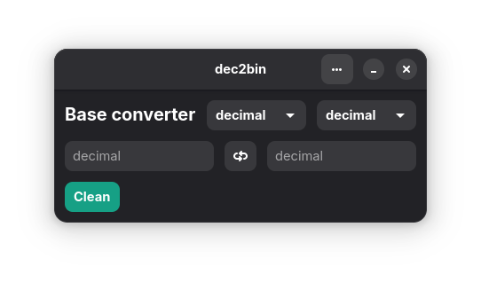

# dec2bin



A simple yet powerful GTK4 application for converting numbers between different numerical bases (binary, decimal, hexadecimal and octal).

## Features

### Core Functionality
- **Bidirectional Conversion**: Convert from any base to any other base
- **Real-time Updates**: Results update instantly as you type
- **Large Number Support**: Handle very large numbers (limited by system memory)
- **Clean GTK4 Interface**: Modern, responsive design with Libadwaita support
- **Smart Input Filtering**: Automatically filters invalid characters for selected base (using regular expressions)
- **Base Selection**: Dropdown menus for easy base selection
- **Placeholder Hints**: Shows current base in input field placeholders
- **Quick Swap**: Button to instantly swap between input/output bases

### Keyboard Shortcuts

| Shortcut       | Action                     |
|----------------|----------------------------|
| Ctrl+Q         | Quit application           |
| Ctrl+X         | Switch between bases       |
| Ctrl+Backspace | Clear both fields          |

## Compiling
Ensure you have dependencies installed:

```bash
# Debian/Ubuntu
sudo apt install build-essential meson libgtk-4-dev libadwaita-1-dev blueprint-compiler

# Fedora
sudo dnf install gcc meson gtk4-devel libadwaita-devel blueprint-compiler
```

> [blueprint-compiler](https://gnome.pages.gitlab.gnome.org/blueprint-compiler/) install from source (recommended)


```bash
meson compile -C build && build/dec2bin                                                
```

## Install

### From source 
Just give executable permission to `install.sh` and run it:

```bash
chmod +x install.sh
./install.sh
```

## License

GPL-3.0-or-later © 2025 Renato Sanchez

## Coming Soon

### Flatpak 
```bash
flatpak install flathub org.riprtx.dec2bin
```
